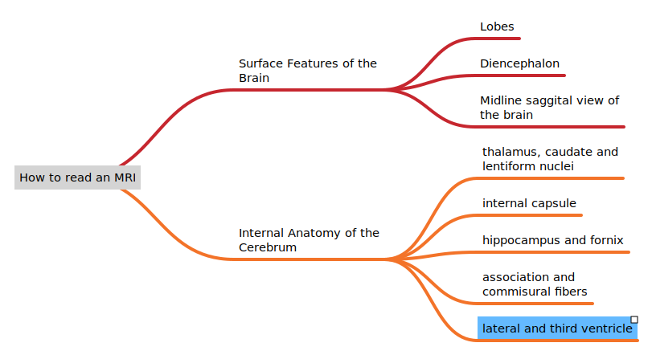

# An Introduction to reading MRIs

### Objective
The objective of this chapter is that you aquire a general sense to read MRIs. You should also be able to grasp the nomenclature for the parts of the basal ganglia and the internal capsule.

### Chapter overview

This image might be overwhelming for some readers and this is why I will start with breaking down the material and starting with the overview. The two most basic divisions of the chapter:
1. Surface Features of the Brain
2. Internal Anatomy of the Brain

### Overview
As is visible in the mind map, the anatomy of the brain will be discussed in a logical manner, ie. from the outside to the inside. It is also the order that most textbooks teach in.

### Lobes
Lets start with the lobes of the brain

### Overview
The lobes have two surfaces: the lateral and the medial surfaces.

#### Lateral Surface
The lateral surfaces of the lobes have sulci and gyri on them. The sulci are the grooves on the surface of the brain while the gyri are the areas between these grooves. The two most important sulci are the central sulcus and the lateral sulcus. These divide the surface of the brain into 4 hemispheres.
1. Frontal Lobe
2. Parietal Lobe
3. Temporal Lobe
4. Occipital Lobe

The two sides of the lateral sulcus can be pullel apart to reveal the insula.