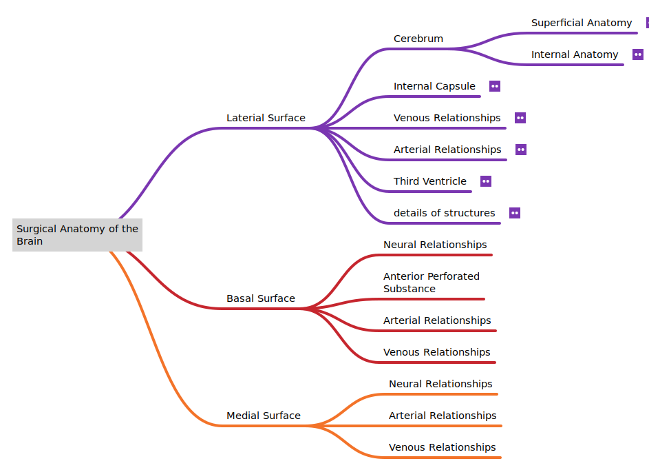

# An Introduction to the Surgical Anatomy of the Brain

The knowledge of the surgical anatomy of the brain is a huge undertaking. The basic overview of the different aspects is providied to you as a mind map. This is the guideline to study.

The brain is divided into 4 lobes:
1. The frontal
2. Parietal 
3. Temporal
4. And the Occipital

